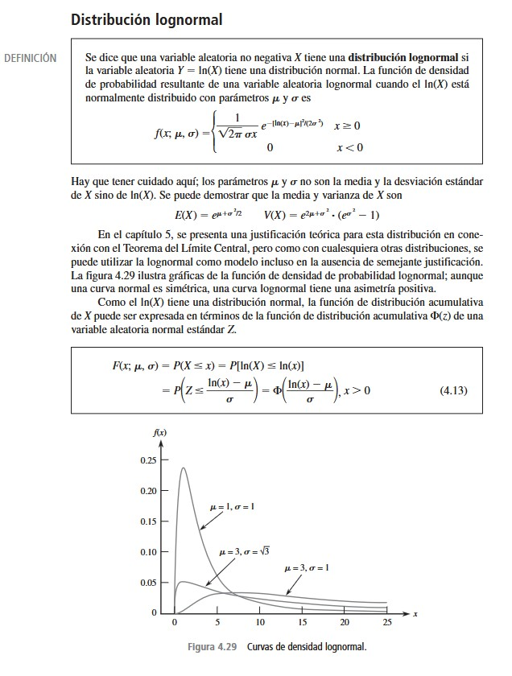

Registro de vertimientos al suelo de los usuarios del recurso hídrico en la jurisdicción de Corantioquia.
<https://www.datos.gov.co/Ambiente-y-Desarrollo-Sostenible/Registro-de-vertimientos-al-suelo/e5yb-6ae7/about_data>.

## Ficha Técnica

| Concepto | Descripción |
|:---|:---|
| **Población** | Vertimientos al suelo de los usuarios del recurso hídrico en la jurisdicción de Corantioquia periodo 2020-2026 |
| **Tamaño de la población** | 7129 vertimientos |
| **Cobertura** | Periodo 2020-2026 |
| **Variable Aleatoria de Rigor o de Peso** | Caudal |
| **Nivel de confianza** | 95%. Nivel de confianza utilizado para que los intervalos estimados representen adecuadamente el comportamiento poblacional del caudal |
| **Error de muestreo** | 10%. Margen de error permitido en la estimación de los parámetros de interés asociados a la variable Caudal. |
| **Tamaño de muestra** | 85 vertimientos seleccionados a partir de la población total de 7129 registros. |
| **Técnica de muestreo** | Muestreo por Hipercubo Latino (Latin Hypercube Sampling - LHS), aplicado sobre la variable continua *Caudal* con el fin de garantizar una representación homogénea de todo el rango de variación de la variable, reduciendo la concentración excesiva de observaciones en zonas de alta densidad y mejorando la cobertura de valores extremos y medianos. |

```{r cargar-datos, warning=FALSE, message=FALSE}
library(dplyr)
library(fitdistrplus)
library(lhs)

# Cargar y limpiar datos
Datos <- read.csv("Datos.csv") %>% 
  filter(!is.na(Caudal), Caudal >= 0)

# Transformación logarítmica
Datos$valor_log <- log1p(Datos$Caudal)

# Comparación visual
par(mfrow=c(1,2))

hist(Datos$Caudal,
     main="Caudal Original",
     col="red",
     xlab="m3/s")

hist(Datos$valor_log,
     main="Caudal Log-Transformado",
     col="blue",
     xlab="log(m3/s)")

# Ajuste normal sobre log-transformación
fn <- fitdist(Datos$valor_log, "norm")

plot(fn)

# Cullen y Frey
par(mfrow = c(1, 2))

descdist(Datos$Caudal,
         boot = 100,
         method = "unbiased",
         graph = TRUE)

title(sub = "Original (Caudal)")

descdist(Datos$valor_log,
         boot = 100,
         method = "unbiased",
         graph = TRUE)

title(sub = "Transformación Log")

par(mfrow = c(1,1))
```

# Distribución lognormal

```{r, echo=FALSE, out.width="70%", fig.align="center"}

```

```{r muestreo-lhs, warning=FALSE, message=FALSE}

# Muestreo Hipercubo Latino
set.seed(123)

caudal <- Datos$Caudal

lhs <- randomLHS(85, 1)

valores_lhs <- quantile(caudal, probs = lhs[,1])

indices <- sapply(valores_lhs, function(x) {
  which.min(abs(caudal - x))
})

muestra_lhs <- Datos[indices, ]

nrow(muestra_lhs)

summary(muestra_lhs$Caudal)

knitr::kable(
  head(muestra_lhs, 10),
  caption = "Primeros registros de la muestra LHS"
)
```

## Tablas de distribución de frecuencias

```{r tablas-frecuencia, warning=FALSE, message=FALSE}

# =========================
# VARIABLE CUENCA
# =========================

freq <- table(muestra_lhs$Cuenca)

tabla_cuenca <- data.frame(
  Cuenca = names(freq),
  Frecuencia = as.vector(freq),
  hi.Freq = round(as.vector(prop.table(freq)), 3),
  Porcentaje.Freq = round(as.vector(prop.table(freq)) * 100, 2)
)

knitr::kable(
  tabla_cuenca,
  caption = "Tabla de frecuencias de la variable Cuenca"
)

# Gráfico de barras

barplot(
  sort(freq),
  horiz = TRUE,
  las = 1,
  cex.names = 0.3,
  col = "lightblue",
  main = "Frecuencia de la variable Cuenca",
  xlab = "Frecuencia"
)

# =========================
# VARIABLE MANEJO EFLUENTE
# =========================

freq <- table(muestra_lhs$Manejo.efluente)

tabla_efluente <- data.frame(
  Manejo_efluente = names(freq),
  Frecuencia = as.vector(freq),
  hi.Freq = round(as.vector(prop.table(freq)), 3),
  Porcentaje.Freq = round(as.vector(prop.table(freq)) * 100, 2)
)

knitr::kable(
  tabla_efluente,
  caption = "Tabla de frecuencias de la variable Manejo efluente"
)

# =========================
# VARIABLE TRATAMIENTO SECUNDARIO
# =========================

freq <- table(muestra_lhs$Tratamiento.secundario)

tabla_tratamiento <- data.frame(
  Tratamiento_secundario = names(freq),
  Frecuencia = as.vector(freq),
  hi.Freq = round(as.vector(prop.table(freq)), 3),
  Porcentaje.Freq = round(as.vector(prop.table(freq)) * 100, 2)
)

knitr::kable(
  tabla_tratamiento,
  caption = "Tabla de frecuencias de la variable Tratamiento Secundario"
)

# =========================
# TABLA NO AGRUPADA - PERMANENTES
# =========================

freq_perm <- table(muestra_lhs$Permanentes)

tabla_perm <- data.frame(
  Permanentes = names(freq_perm),
  Frecuencia = as.vector(freq_perm),
  hi.Freq = round(as.vector(prop.table(freq_perm)), 3),
  Porcentaje = round(as.vector(prop.table(freq_perm)) * 100, 2)
)

knitr::kable(
  tabla_perm,
  caption = "Tabla de frecuencias no agrupada - Permanentes"
)

hist(
  muestra_lhs$Permanentes,
  main = "Histograma de Permanentes",
  xlab = "Permanentes",
  ylab = "Frecuencia",
  col = "lightblue",
  breaks = seq(
    min(muestra_lhs$Permanentes) - 0.5,
    max(muestra_lhs$Permanentes) + 0.5,
    by = 1
  )
)

# =========================
# TABLA NO AGRUPADA - TRANSITORIAS
# =========================

freq_trans <- table(muestra_lhs$Transitorias)

tabla_trans <- data.frame(
  Transitorias = names(freq_trans),
  Frecuencia = as.vector(freq_trans),
  hi.Freq = round(as.vector(prop.table(freq_trans)), 3),
  Porcentaje = round(as.vector(prop.table(freq_trans)) * 100, 2)
)

knitr::kable(
  tabla_trans,
  caption = "Tabla de frecuencias no agrupada - Transitorias"
)

hist(
  muestra_lhs$Transitorias,
  main = "Histograma de Transitorias",
  xlab = "Transitorias",
  ylab = "Frecuencia",
  col = "lightgreen",
  breaks = seq(
    min(muestra_lhs$Transitorias) - 0.5,
    max(muestra_lhs$Transitorias) + 0.5,
    by = 1
  )
)

# =========================
# TABLA AGRUPADA - CAUDAL
# =========================

muestra_lhs$Caudal <- as.numeric(
  gsub(",", ".", as.character(muestra_lhs$Caudal))
)

# Número de intervalos según Sturges
k <- nclass.Sturges(muestra_lhs$Caudal)

# Crear intervalos
clases <- cut(
  muestra_lhs$Caudal,
  breaks = k
)

# Tabla de frecuencias agrupadas
tabla_caudal <- data.frame(
  Intervalo = names(table(clases)),
  Frecuencia = as.vector(table(clases)),
  hi.Freq = round(
    as.vector(prop.table(table(clases))),
    3
  ),
  Porcentaje = round(
    as.vector(prop.table(table(clases))) * 100,
    2
  )
)

knitr::kable(
  tabla_caudal,
  caption = "Tabla de frecuencia agrupada - Caudal"
)

# Histograma
hist(
  muestra_lhs$Caudal,
  breaks = "Sturges",
  col = "lightblue",
  main = "Histograma de Caudal",
  xlab = "Caudal"
)
```

## Medidas de Tendencia Central

```{r tendencia-caudal}

# Convertir a numérico
muestra_lhs$Caudal <- as.numeric(
  gsub(",", ".", as.character(muestra_lhs$Caudal))
)

# Moda
moda_caudal <- as.numeric(
  names(sort(table(muestra_lhs$Caudal),
  decreasing = TRUE)[1])
)

# Tabla
tendencia_caudal <- data.frame(
  Media = mean(muestra_lhs$Caudal, na.rm = TRUE),
  Mediana = median(muestra_lhs$Caudal, na.rm = TRUE),
  Moda = moda_caudal
)

knitr::kable(
  tendencia_caudal,
  caption = "Medidas de tendencia central - Caudal"
)

```

```{r tendencia-permanentes}

moda_perm <- as.numeric(
  names(sort(table(muestra_lhs$Permanentes),
  decreasing = TRUE)[1])
)

tendencia_perm <- data.frame(
  Media = mean(muestra_lhs$Permanentes, na.rm = TRUE),
  Mediana = median(muestra_lhs$Permanentes, na.rm = TRUE),
  Moda = moda_perm
)

knitr::kable(
  tendencia_perm,
  caption = "Medidas de tendencia central - Permanentes"
)

```

```{r tendencia-transitorias}

moda_trans <- as.numeric(
  names(sort(table(muestra_lhs$Transitorias),
  decreasing = TRUE)[1])
)

tendencia_trans <- data.frame(
  Media = mean(muestra_lhs$Transitorias, na.rm = TRUE),
  Mediana = median(muestra_lhs$Transitorias, na.rm = TRUE),
  Moda = moda_trans
)

knitr::kable(
  tendencia_trans,
  caption = "Medidas de tendencia central - Transitorias"
)

```

